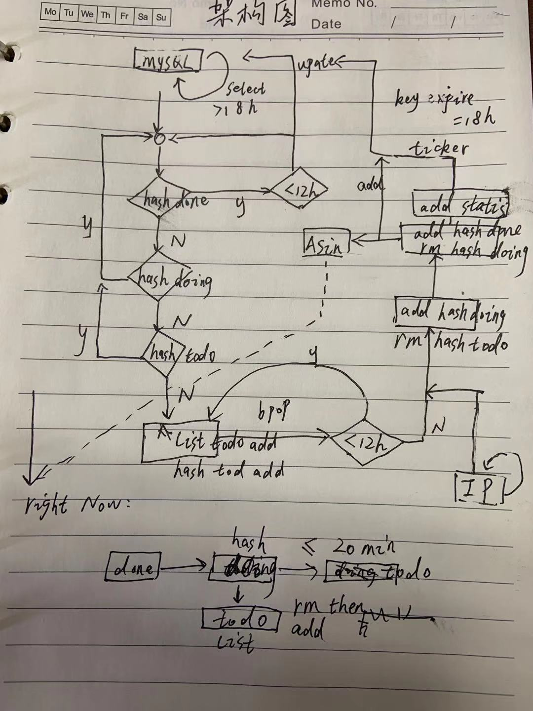

# 饕餮选款服务端：Golang高性能精细化选款系统

[](https://github.com/hunterhug/taotie/network)
[](https://github.com/hunterhug/taotie/stargazers)
[](https://github.com/hunterhug/taotie)
[](https://goreportcard.com/report/github.com/hunterhug/taotie)
[](https://github.com/hunterhug/taotie/issues)

核心采集库使用: [Marmot | HTTP Download| 为了对接API和写爬虫能快点的封装轮子](https://github.com/hunterhug/marmot)

`Golang` 开发的高性能精细化选款系统，该仓库为服务端代码。支持定时和实时采集亚马逊某商品类目或商品信息，提供可视化界面进行数据分析。微服务分布式部署，支持横向拓展。

# 技术选型

使用中间组件：

1. MySQL：事务性数据，商品基本信息。
2. Redis：维持采集队列，消息通信，分布式Session。
3. ElasticSearch：事务性不强的全文检索数据，商品文本搜索。(暂时未用)

# 微服务说明

- Web API：提供客户端接口操纵数据，如：增加采集类目和商品，查看数据等
- Proxy：代理IP池服务
- AwsCategoryTimer：亚马逊类目定时入库服务
- AwsAsinTimer： 亚马逊商品定时入库服务
- AwsCategoryTask：亚马逊类目采集服务
- AwsAsinTask：亚马逊商品采集服务

# 原理

采用代理IP池，每12小时采集一次类目任务或ASIN任务，存入数据库。您可以通过增加三种任务，分别是：

1. https://www.amazon.com/Best-Sellers/zgbs/wireless
2. https://www.amazon.com/s?me=A38PDDQNY9S8ES
3. https://www.amazon.com/dp/B07ZPC9QD4

程序会定时采集以上任务，然后将商品入库，通过可视化界面你可以查看数据趋势，并且如果必要时，可进行实时采集。

调度逻辑稳定，高效，自动攻克被机器人验证码困扰，您值得拥有。

# 架构图



# 代码结构

```
├── core
│   ├── config      配置
│   ├── controllers 控制器
│   ├── flog        日志
│   ├── model       模型
│   ├── router      路由
│   ├── server      服务初始化
│   ├── session     分布式jwt
│   ├── spider      采集逻辑(暂不开源)
│   └── util        工具
├── doc
│   ├── Insomnia_2019-11-27.json    文档
│   ├── db      数据库安装脚本
│   └── install 服务安装脚本
├── go.mod      依赖库管理
├── main.go     代码入口
```

# 接口文档

见 `doc/Insomnia_2019-11-27.json`，接口支持完整的用户管理，权限管理，数据管理。

# 部署

## 二进制部署

安装 `Golang1.13`，直接编译。

```
make build
./taotie -f=./config.yaml
```

配置文件说明：

```
# 全局配置
global:
  # 角色: Web/Proxy/AwsCategoryTimer/AwsAsinTimer/AwsCategoryTask/AwsAsinTask/All
  role: All
  # 服务监听地址，默认值：0.0.0.0
  host: 0.0.0.0
  # 服务监听端口，默认值：8080
  port: 8080
  # 系统日志路径，默认值：data/log/svr.log
  log_path: ./data/log/svr.log
  # 时区
  time_zone: 8
  # 单点登录
  single_login: true
  # session有效期
  session_expire_time: 604800
  # 文件存储位置，默认值：data/storage
  storage_path: ./data/storage
  # 使用对象存储
  use_oss: false
  # 允许邮箱注册，修改密码
  can_mail: true

# 数据库配置
db:
  # 数据库名，默认值：taotie
  name: taotie
  # 数据库地址，默认值：127.0.0.1
  host: 127.0.0.1
  # 数据库用户名，*必填
  user: root
  # 数据库密码，*必填
  pass: hunterhug
  # 数据库端口，默认值：3306
  port: 3307
  # 数据库最大空闲连接数，默认值：10
  max_idle_conns: 10
  # 数据库最大打开连接数，默认值：20
  max_open_conns: 20
  # 数据库日志调试，默认值：false
  debug: true
  # 数据库调试日志是否打印到文件中
  # 当 debug = true 时有效，false 时打印到终端，默认值：false
  debug_to_file: false
  # 数据库调试日志打印到的文件路径
  # 当 debug_to_file = true 时有效，默认值：data/log/db.log
  debug_to_file_path: ./data/log/db.log

# Redis配置
redis:
  # 必填
  host: 127.0.0.1:6380
  # 非必填
  max_idle: 64
  max_active: 0
  idle_timeout: 120
  database: 3
  pass: hunterhug

# 阿里云对象存储配置，可选
oss:
  # 区域和桶基本配置
  endpoint: oss-cn-shenzhen.aliyuncs.com
  bucket_name: th
  # 编程密钥
  access_key_id: LTAIu
  access_key_secret: d72l

# 邮箱服务器配置，可选
mail:
  # 必填
  host: smtp-mail.outlook.com
  port: 587
  email: gdccmcm14@live.com
  password: cccc
  # 非必填
  subject: "TaoTie Code"
  body: "%s Code is <br/> <p style='text-align:center'>%s</p> <br/>Valid in 5 minute."

# 采集配置
spider:
  # 此账号需要购买：http://proxy.mimvp.com，其他代理IP商接口待开发
  account: iasie@qq.com
  # 类目任务采集线程数
  aws_category_thread: 10
  # 商品任务采集线程数
  aws_asin_thread: 10
```

## 生产环境Docker部署

安装`docker`和`docker-compose`后：

```
# 安装数据库环境 
make install_db

# 第一次安装
make build_docker
make install

# 每次代码更新后都需要
make build_docker
make restart
```

API地址：http://127.0.0.1:8080

打开集成的数据库软件UI进行数据查看:

MySQL： http://127.0.0.1:8000/index.php

Redis： http://127.0.0.1:8001/

# 免责声明

本产品遵循署名-非商业性使用-禁止演绎 4.0 国际。您可用于教育，学习，但不可用于商业盈利。

关于版权，爬虫有风险, 本人不承担由此开源项目带来的任何责任，核心代码不提交仓库，请私信。

```
	版权所有，侵权必究
	署名-非商业性使用-禁止演绎 4.0 国际
	警告： 以下的代码版权归属hunterhug，请不要传播或修改代码
	你可以在教育用途下使用该代码，但是禁止公司或个人用于商业用途(在未授权情况下不得用于盈利)
	商业授权请联系邮箱：gdccmcm14@live.com QQ:459527502

	All right reserved
	Attribution-NonCommercial-NoDerivatives 4.0 International
	Notice: The following code's copyright by hunterhug, Please do not spread and modify.
	You can use it for education only but can't make profits for any companies and individuals!
	For more information on commercial licensing please contact hunterhug.
	Ask for commercial licensing please contact Mail:gdccmcm14@live.com Or QQ:459527502

	2019.11 by hunterhug
```